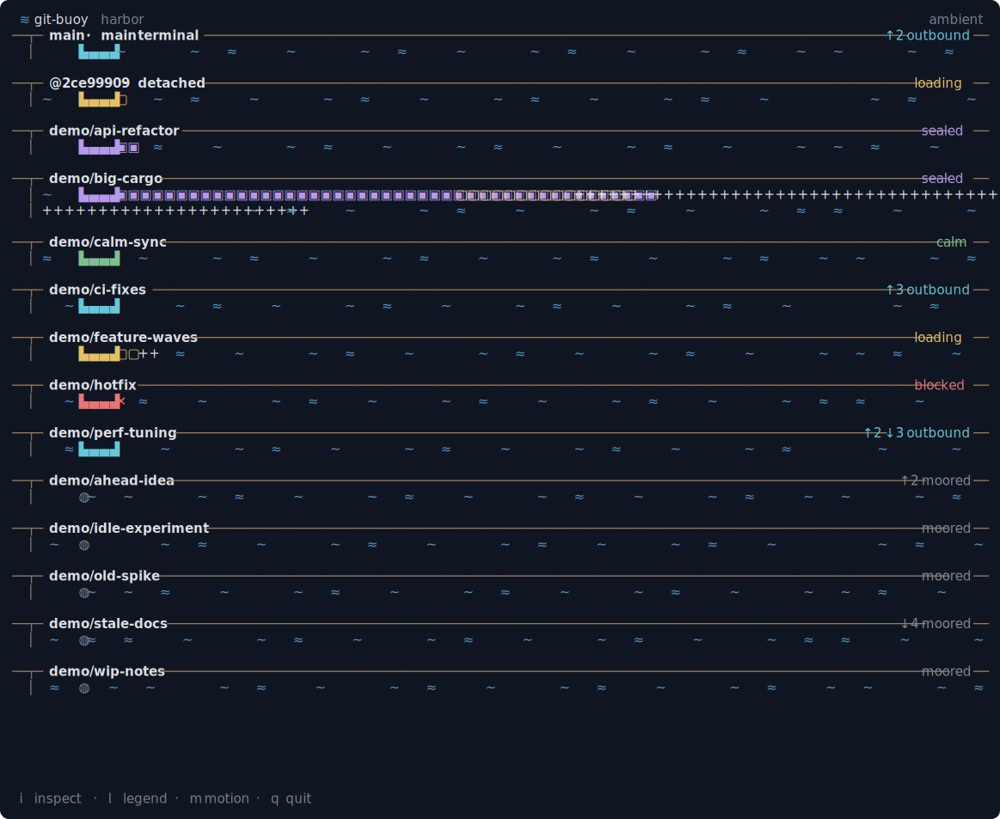
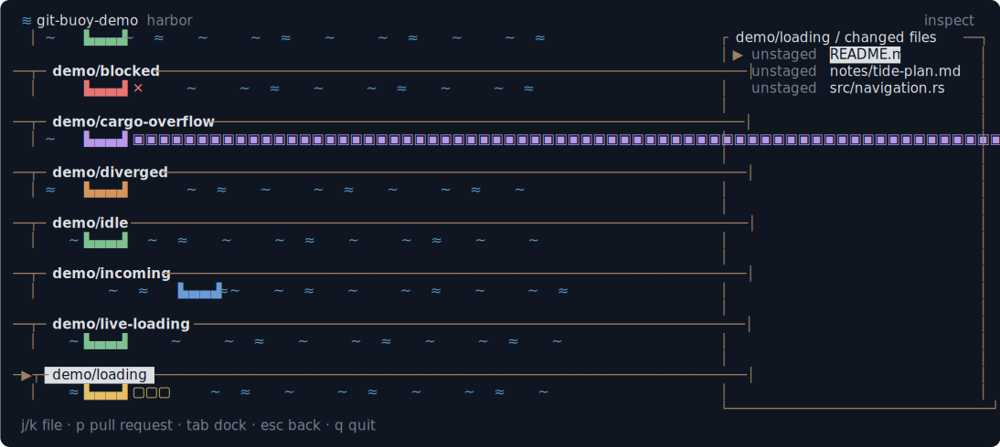

# Git Buoy

> A living terminal harbor for understanding parallel software work at a glance.



<sup>Ambient mode against a demo repository with synthetic branches and worktrees, arranged to show every dock condition at once. `demo/big-cargo` has so many pending changes that its cargo wraps onto a second row.</sup>

Git Buoy is an experimental terminal application that turns the state of a Git repository into an animated seaport. Instead of presenting another commit graph or a wall of status text, it gives branches, worktrees, coding agents, pull requests, and CI activity a shared visual language.

The goal is not to disguise Git. It is to make a busy repository feel legible, especially when several worktrees or coding agents are active at once, while creating something calm and interesting enough to leave running in a spare terminal pane.

## Status

Git Buoy is in early development. The stack is Rust with [ratatui](https://ratatui.rs), chosen and recorded in [docs/adr/0001-implementation-stack.md](docs/adr/0001-implementation-stack.md). The current build covers the first milestone scope: it discovers branches and linked worktrees in one local repository, watches their state, and renders them as an animated harbor with keyboard inspection.

## Getting started

Requires a stable [Rust toolchain](https://rustup.rs) and Git.

```sh
git clone https://github.com/markg-05/git-buoy.git
cd git-buoy
cargo run --release -- path/to/some/repository
```

With no path argument, Git Buoy observes the repository containing the current directory.

| Key | Action |
| --- | --- |
| `i` or `Enter` | Enter inspect mode on the current dock |
| `Tab` / `j` / `k` / arrows | Select a dock |
| `l` or `?` | Toggle the legend overlay |
| `Esc` | Close the legend, then leave inspect mode, then quit |
| `m` | Toggle reduced motion |
| `q` | Quit |

Useful flags: `--reduced-motion` starts with a static scene, `--fps` sets the ambient animation rate, and `--poll-interval` sets how often the repository is re-read.

## Product intent

Modern development increasingly involves several streams of work happening in parallel: a developer in one branch, agents in separate worktrees, automated checks running remotely, and pull requests waiting to merge. Existing Git tools are excellent at operating on those objects, but few make the whole workspace feel observable as one system.

Git Buoy should answer questions such as:

- What work is active right now?
- Which worktrees are clean, changing, idle, or blocked?
- What is ready to leave the machine as a commit or push?
- Which pull requests are waiting for review or CI?
- Where are conflicts or failures preventing work from landing?

It should answer them primarily through motion and spatial relationships, with precise details available on demand.

## The harbor metaphor

The metaphor is functional, not decorative. Every object in the scene should communicate repository state consistently.

| Development concept | Harbor representation |
| --- | --- |
| Repository | Harbor |
| Default branch | Main terminal |
| Branch or worktree | Dock |
| Active developer or coding agent | Vessel at a dock |
| Uncommitted changes | Cargo being loaded |
| Commit | Sealed cargo container |
| Push | Outbound vessel |
| Pull request | Vessel awaiting clearance |
| CI checks | Harbor inspection |
| Merge conflict | Blocked shipping lane |
| Successful merge | Cargo arriving at the main terminal |
| Release | Convoy departing the harbor |

The mapping will evolve as the product is prototyped. Clarity takes precedence over completing the metaphor.

## Reading the harbor

Every dock resolves to a single **condition**, shown by color and by a word on its pier. The same legend is available inside the application at any time by pressing `l`.

| | Condition | What it means |
| --- | --- | --- |
| 🟩 | **calm** | Checked out, committed, and in sync with the upstream. |
| 🟨 | **loading** | Uncommitted changes are still being loaded (modified or new files). |
| 🟪 | **sealed** | Changes are staged, ready to become a commit. |
| 🟦 | **outbound** | Commits are ahead of the upstream, ready to push. |
| 🟥 | **blocked** | A merge conflict or an in-progress operation is stopping work from landing. |
| ⬜ | **moored** | A branch with no worktree checked out. |

A vessel's hull carries **cargo** that counts the pending change categories, and a few **symbols** stand in for the rest:

| Symbol | Meaning |
| --- | --- |
| `▣` | Staged files |
| `▢` | Unstaged (modified) files |
| `·` | Untracked files |
| `✕` | Conflicted files |
| `▙▄▄▟` | A vessel: work is checked out at this dock |
| `◍` | A mooring buoy: a branch with no worktree |
| `↑` / `↓` | Commits ahead of / behind the upstream |

## Intended experience

Git Buoy should work in two complementary modes:

1. **Ambient mode:** A quiet, animated overview suitable for a spare terminal pane. Important state changes should be noticeable without demanding attention.
2. **Inspect mode:** Keyboard-driven navigation for selecting a dock, vessel, change set, pull request, or check and seeing the underlying Git information.



<sup>Inspect mode: the detail panel floats over the full-width harbor and sizes itself to its content, so workspace paths and commit messages stay on one line.</sup>

The visual style should feel cozy, precise, and restrained. Animation should carry information rather than merely add activity. The application must remain understandable with reduced motion and in terminals with limited color support.

## Initial scope

The first useful version focuses on one local repository and establishes the core model:

- Discover branches and linked worktrees.
- Observe clean, modified, staged, ahead, behind, and conflicted states.
- Update the scene as local repository state changes.
- Represent concurrent work without requiring any particular coding agent.
- Provide keyboard inspection of the real Git data behind each visual object.
- Degrade gracefully across terminal sizes and color capabilities.

Remote hosting data, including pull requests, reviews, CI, and releases, belongs in a later milestone after the local experience is convincing.

## Non-goals

Git Buoy is not intended to be:

- A complete replacement for Git, a shell, or established Git clients.
- A Git tutorial that simulates commands.
- A historical commit-replay tool.
- A dashboard that requires an AI provider or proprietary service.
- A generic animation with repository statistics painted on top.

## Product principles

- **Truth before theater.** The scene must accurately reflect repository state.
- **Useful while idle.** Ambient mode should provide value without interaction.
- **Details on demand.** The metaphor offers orientation; inspect mode supplies precision.
- **Local first.** Core functionality should work offline against an ordinary Git repository.
- **Agent agnostic.** Work should be visible whether produced by a person, script, or coding agent.
- **Terminal native.** Keyboard control, low overhead, and broad terminal compatibility are fundamental.
- **Delight through restraint.** A small number of excellent animations is better than constant spectacle.

## Contributing

The project is young and the information model is still settling, so expect churn. Discussion, prior-art references, accessibility concerns, and critiques of the information model are especially welcome.

Before making changes, read [AGENTS.md](AGENTS.md). It records the working expectations, the module layering, and the exact commands CI runs.

## License

Git Buoy is open-source software licensed under the [MIT License](LICENSE).
